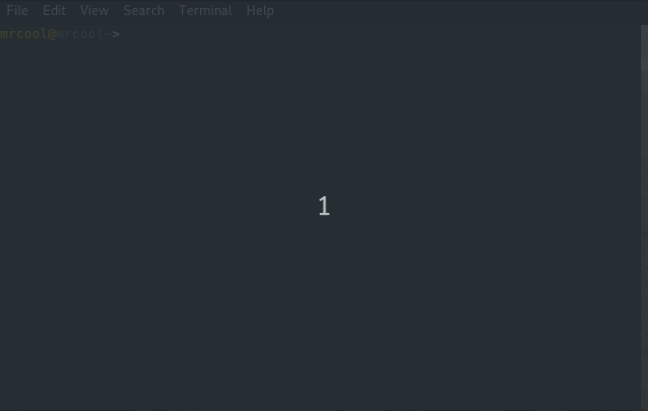

# repl-rs
Rust repl though with caveat ^^

## Keywords
**reset** => reset repl

**show** => show repl current code

**add** *<dep_list>* => add dependencies (requires [cargo-edit](https://github.com/killercup/cargo-edit))

## Showcase

## Plans
**1-** Use [tuikit](https://github.com/lotabout/tuikit) as TUI

**2-** with **1** done, It would be possible to handle multiline input and cycling through history with arrow keys
