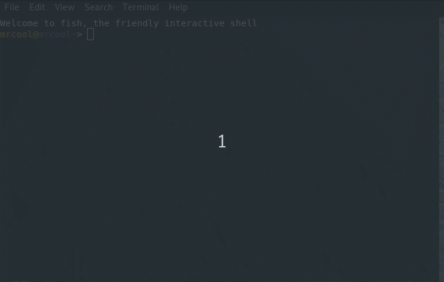

# repl-rs
Rust repl though with caveat ^^

## Keywords
**reset** => reset Repl

**show** => show Repl current code

**add** *<dep_list>* => add dependencies (requires https://github.com/killercup/cargo-edit)

## Showcase

